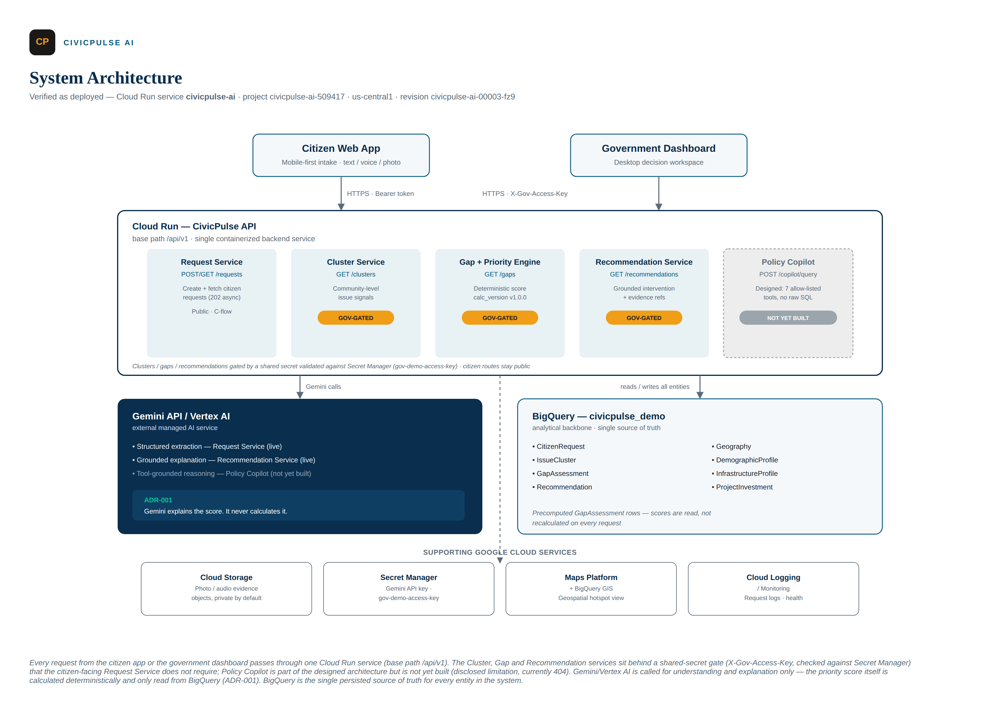
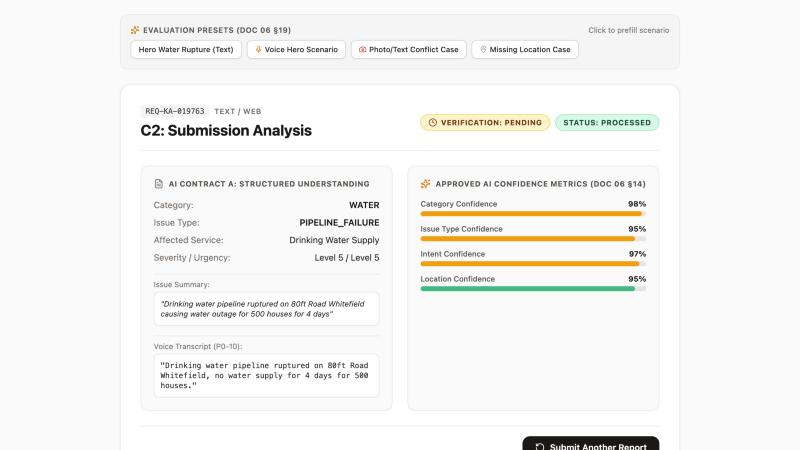
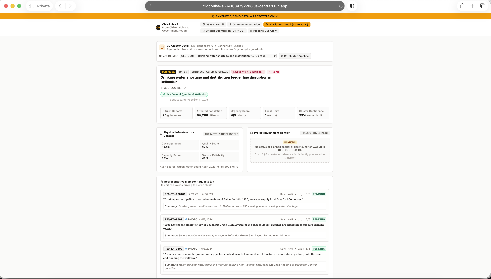
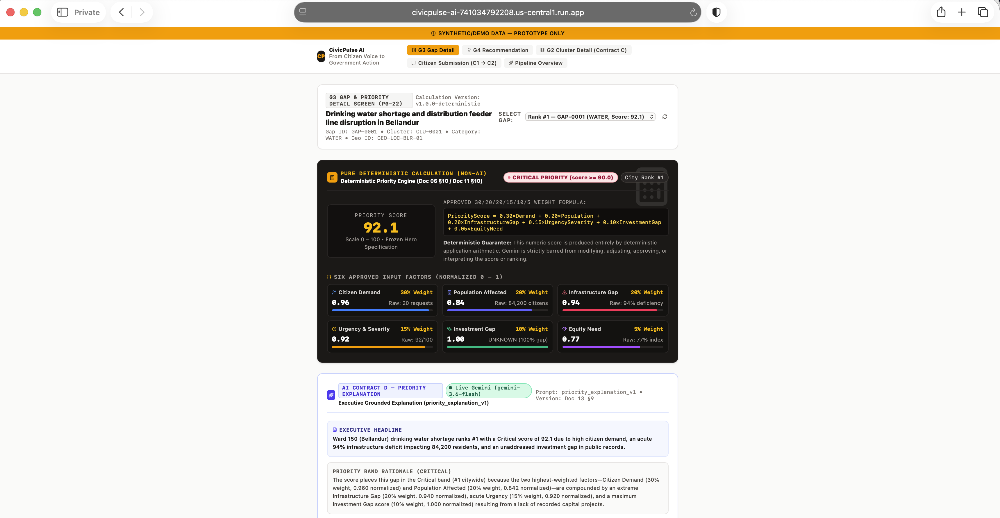
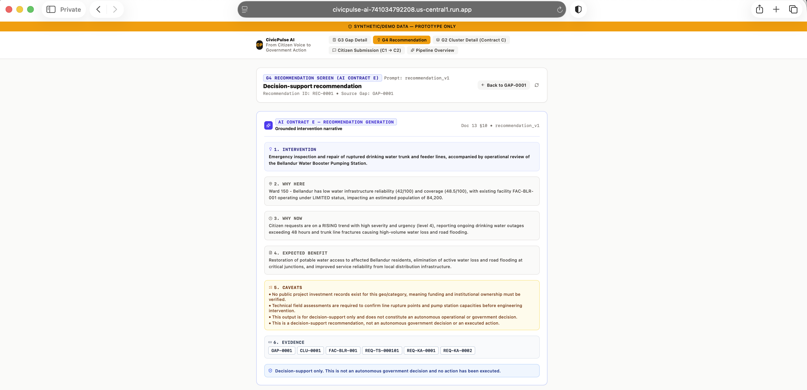

# CivicPulse AI

> "From Citizen Voice to Government Action"

Hackathon prototype for **Google Cloud "Build with AI: Code for Communities 2.0"**.

Citizen requests are classified (Contract A), clustered (Contract C), scored with a deterministic priority engine (Contract D), and turned into advisory recommendations (Contract E). Persistence is **BigQuery** dataset `civicpulse_demo` when GCP credentials are present, with a **static JSON** seed fallback under `data/seed/`.

Policy Copilot (Contract F) is **not implemented**.

---

## Architecture



Citizen Web App and Government Dashboard clients call a single Cloud Run
service (`civicpulse-ai`) exposing `/api/v1`. Request, Cluster, Gap/Priority
and Recommendation services read/write BigQuery (`civicpulse_demo`) and call
Gemini/Vertex AI for extraction and grounded explanation only — the priority
score is always calculated deterministically, never by Gemini. Policy Copilot
is designed and fully specified but not yet built (see note above). Cloud
Storage, Secret Manager, Maps Platform + BigQuery GIS, and Cloud Logging
support the core flow. The three G-flow routes (`/clusters`, `/gaps`,
`/recommendations`) require the gov demo access key; `/requests` is public.

The full pitch deck is archived at [docs/deck/CivicPulse_AI_Pitch_Deck.pdf](docs/deck/CivicPulse_AI_Pitch_Deck.pdf).

---

## Google Cloud Services Used

- **Cloud Run** — hosts the unified `civicpulse-ai` service (`/api/v1`).
- **BigQuery** — primary persistence for requests, clusters, gaps and recommendations (dataset `civicpulse_demo`), with a static-JSON fallback when credentials are absent.
- **Vertex AI / Gemini API** — request understanding (Contract A), photo-evidence reading (Contract B), cluster/context summarization (Contract C support), priority explanation (Contract D, explanation only — never the score), and recommendation generation (Contract E).
- **Cloud Storage** — citizen-submitted photo evidence.
- **Secret Manager** — the government demo access key and other runtime secrets.
- **Maps Platform + BigQuery GIS** — geographic context for clustering and cluster/gap detail views.
- **Cloud Logging** — request correlation and operational logging.

---

## AI Capabilities & Guardrails

- **Contract A — Request understanding**: Gemini classifies free-text/voice citizen requests into a closed taxonomy. Low-confidence or location-missing cases are returned as `UNKNOWN` / `NEEDS_CLARIFICATION` rather than a guessed category.
- **Contract B — Photo evidence**: images are read as *supporting* evidence for a request, never treated as ground truth on their own.
- **Contract C — Clustering**: semantic similarity is combined with taxonomy and geography guardrails so unrelated requests are not merged on wording alone.
- **Contract D — Priority scoring**: the priority score is produced by a **deterministic, versioned** formula (Demand 30% / Population 20% / Infrastructure gap 20% / Urgency-severity 15% / Investment gap 10% / Equity-need 5%). Gemini explains the score in plain language; it cannot change the score, the weights, or the rank.
- **Contract E — Recommendation**: Gemini drafts an intervention recommendation grounded only in retrieved evidence for that gap, with stated caveats. There is no execute/approve endpoint — every recommendation is decision support, not an autonomous action.
- **Contract F — Policy Copilot**: fully specified (allow-listed, read-only tools; grounded only in approved CivicPulse data) but **not implemented** in this build.
- Citizen-submitted text, audio and images are treated as **untrusted input** — any instruction-like content inside a submission is ignored, not executed.

---

## Project Structure

```
civicpulse-ai/
├── backend/
│   ├── api/
│   │   ├── routes/                 # requests, clusters, gaps, recommendations
│   │   └── middleware/             # correlationId, logging, dataSource, errors
│   ├── services/
│   │   ├── request_ai/             # Contract A + B + voice
│   │   ├── clustering/             # Contract C
│   │   ├── decision_intelligence/  # Contract D (priority is never Gemini)
│   │   ├── recommendations/        # Contract E
│   │   └── copilot/                # placeholder only
│   ├── repositories/               # BigQuery or local JSON
│   ├── models/
│   ├── common/                     # config, taxonomy, BigQuery client
│   ├── app.ts                      # Express app (GET /health + /api/v1)
│   └── server.ts                   # Standalone backend (:8080)
├── frontend/                       # LandingPage tabs G3 / G4 / G2 / C1→C2
├── data/
│   ├── schemas/                    # BigQuery DDL + taxonomy.json
│   └── seed/                       # Fixture JSON (also loaded into BigQuery)
├── prompts/                        # Versioned Gemini templates
├── tests/{unit,integration,ai_eval}/
├── scripts/                        # seed load, integrity, evidence capture
├── docs/architecture/              # system architecture diagram
├── .env.example
├── server.ts                       # Unified Vite + Express (:3000)
└── package.json
```

---

## Installation

Node.js v18+ and npm:

```bash
cd civicpulse-ai
npm install
cp .env.example .env
```

Fill `.env` locally. Gemini calls need `GEMINI_API_KEY`. BigQuery persistence needs `GOOGLE_CLOUD_PROJECT` plus Application Default Credentials.

Load seed tables (optional, once credentials and dataset exist):

```bash
npm run bq:load-seed
```

---

## Running Locally

### 1. Unified full-stack (default)

```bash
npm run dev
```

Listens on `PORT` / `BACKEND_PORT`, default **8080**.

- App: [http://localhost:8080](http://localhost:8080)
- Health: [http://localhost:8080/health](http://localhost:8080/health) → `{"status":"ok"}`

Citizen submission (C-flow) is public. Cluster / gap / recommendation screens (G-flow) prompt for the demo access key when `GOV_DEMO_ACCESS_KEY` is set (Cloud Run). Locally, leave that variable empty to skip the gate.

### 2. Separate processes

```bash
npm run dev:backend    # Express on :8080 (or PORT / BACKEND_PORT)
npm run dev:frontend   # Vite on :3000
```

---

## API

Stable base path: **`/api/v1`**. Health is unversioned.

| Method | Path | Role |
|---|---|---|
| GET | `/health` | Liveness |
| POST | `/api/v1/requests` | Create + process (HTTP 202) |
| GET | `/api/v1/requests/:request_id` | Request + media evidence |
| GET | `/api/v1/clusters` | List clusters |
| POST | `/api/v1/clusters/run-pipeline` | Run clustering pipeline |
| GET | `/api/v1/clusters/:cluster_id` | Cluster detail (`CLU-XXXX`) |
| GET | `/api/v1/gaps` | List gaps (priority descending) |
| GET | `/api/v1/gaps/:gap_id` | Gap detail (`GAP-XXXX`) |
| GET | `/api/v1/recommendations/:recommendation_id` | Recommendation detail (`REC-XXXX`) |

Responses may include `data_source`: `BIGQUERY` or `STATIC_JSON`.

There is no recommendation execute endpoint. Recommendations are decision support, not autonomous government action.

G-flow routes (`/clusters`, `/gaps`, `/recommendations`) require header `X-Gov-Access-Key` (or query `gov_access_key`) when `GOV_DEMO_ACCESS_KEY` is configured. C-flow `/requests` does not.

Live demo: [https://civicpulse-ai-741034792208.us-central1.run.app](https://civicpulse-ai-741034792208.us-central1.run.app) (Cloud Run revision `civicpulse-ai-00003-fz9`).

---

## Persistence

When ADC + `GOOGLE_CLOUD_PROJECT` can reach dataset `civicpulse_demo` (us-central1), repositories read and write BigQuery. Otherwise they use `data/seed/*.json`.

Hero IDs: `REQ-TS-000101`, `CLU-0001`, `GAP-0001`, `REC-0001`. Hero priority score **92.1** is computed by the deterministic engine, never by Gemini.

---

## Screenshots

Hero scenario: a citizen-reported drinking-water shortage in Bellandur, followed end-to-end through the pipeline.

| Screen | Description |
| --- | --- |
|  | **C2 — AI Understanding Result** (Contract A): structured classification of a citizen water-access request — category, severity, confidence. |
|  | **G2 — Cluster Detail** (Contract C): community-level hotspot (CLU-0001) with demand, population, infrastructure and investment evidence. |
|  | **G3 — Gap & Priority Detail** (Contract D): deterministic six-factor priority score (92.1) with a Gemini-generated, grounded explanation. |
|  | **G4 — Recommendation** (Contract E): evidence-grounded intervention recommendation (REC-0001) — decision support only, no autonomous action. |

---

## Tests

```bash
npm test
npm run lint
npm run validate:data
```

---

## Environment Variables

See `.env.example` for every name the app reads. Do not put secrets in the example file.

---

## Responsible AI

CivicPulse is designed around human oversight and auditability. It uses a closed taxonomy with an UNKNOWN/NEEDS_CLARIFICATION state rather than forcing uncertain classifications. Multimodal evidence is treated as supporting evidence, not absolute truth. Semantic clustering includes geography and taxonomy guardrails. Priority scores are generated by a deterministic, versioned model; Gemini explains them but cannot override them. Recommendations are grounded in stored evidence and include caveats. The Policy Copilot has controlled read-only tools.

---

## Team / Contributors

Built solo by **Ananda Sarma Damaraju** for Google Cloud — *Build with AI: Code for Communities 2.0*.
